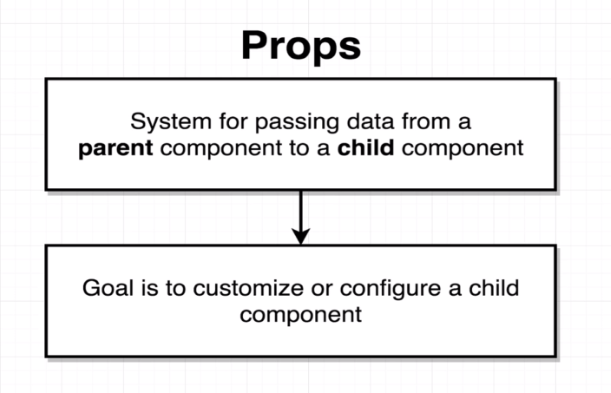
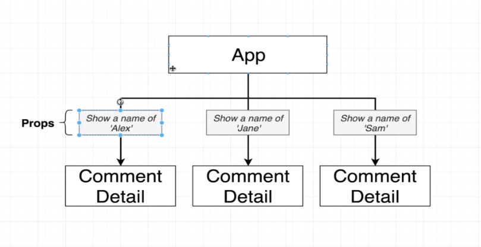

# Communicating with Props

**3 Tenents of React Components**


Create a new application `create-react-app components --use-npm`

Deleted all the pre built `src` files

> **Added Semantic UI for CSS Styling.**

```html
<link
  rel="stylesheet"
  href="https://cdnjs.cloudflare.com/ajax/libs/semantic-ui/2.4.1/semantic.min.css"
/>
```

> **New way to check the changes in the files.**

Add `>` infront of the commit names in md file. Reference it to the commit file.

> **Created a Comment Component with Semantic UI**

Installed [Faker package](https://github.com/marak/Faker.js/) to insert fake image to our app.

This was done using the API provided by them. A lot can be found in their repo.

Eg.

```jsx

```

> **Image Faker Installed and Added**

> **Copied one comment section to 2 more**

Created a CommentDetail.js and pasted the repeating comment code.

> **Seperate Component for Repeating Comment Section**

Exported and imported ComponentDetail.js and added to main component as `<ComponentDetail />`

Copied thrice to get the same result as before

> **S03L32 Component Nesting**

Using Props System, values can be passed from Parent Component to Child Component





> **S03L33 React's Props System**

Using Props System Child cannot send to Parent. But an indirect way will be taught later.

**Props => Properties**

Code like `<ComponentDetail author="Sam" />`.
Get the `author` property in CommentDetail.js by passing `props` as an argument.
Then access it as a normal JS variable `props.author`.

> **S03L34 Passing and Receiving Props**

Added Props for time, avatar and comment.

> **S03L34 Passing Multiple Props**
